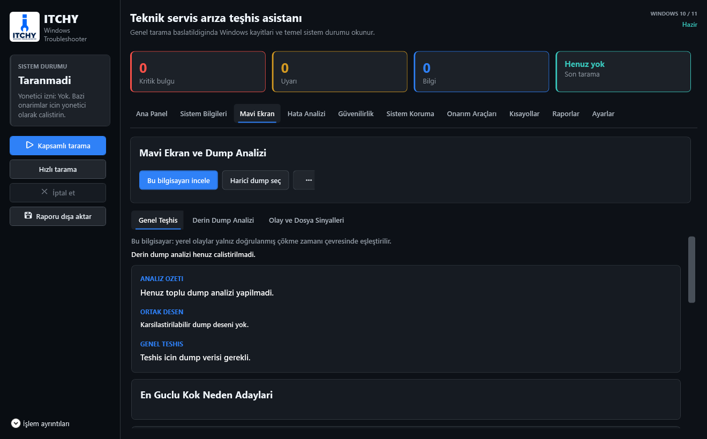
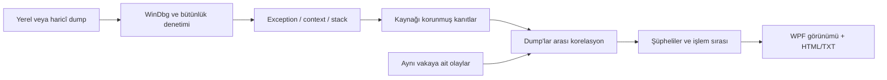

<div align="center">


# ITCHY Windows Troubleshooter

**Windows 10/11 için yerel sistem teşhisi, karşılaştırmalı mavi ekran analizi ve teknisyen raporları.**

[](https://github.com/Bogazitchy/Itchy-Windows-Troubleshooter/releases/latest)


[](https://github.com/Bogazitchy/Itchy-Windows-Troubleshooter/releases)

[**v1.4.1 EXE indir**](https://github.com/Bogazitchy/Itchy-Windows-Troubleshooter/releases/download/v1.4.1/ITCHY-Windows-Troubleshooter-v1.4.1-win-x64.exe) · [Sürüm notları](docs/releases/v1.4.1.md) · [Hata bildir](https://github.com/Bogazitchy/Itchy-Windows-Troubleshooter/issues)

</div>

---

## Önce Kanıt, Sonra Teşhis

ITCHY yalnızca bir stop code veya sürücü adı göstermez. Dump'ları karşılaştırır, olay kayıtlarını inceler ve bulguları **kanıt, teknik yorum ve şüpheli kaynak** olarak ayırır. Sonuçlar tamamen yerel, deterministik kurallarla üretilir; haricî AI API'si veya API anahtarı gerekmez.

> Bir sürücünün stack'te bulunması suçlu olduğunu kanıtlamaz. `ntoskrnl.exe`, aktif kullanıcı uygulaması ve Kernel-Power 41 tek başına kök neden sayılmaz.

## v1.4.1: Yeni Logo

Resmî ITCHY logosu artık uygulamanın marka alanında, Ayarlar bölümünde, pencere/görev çubuğu simgesinde ve EXE dosyasında kullanılıyor. Şeffaf orijinal PNG korunur; Windows simgesi 16-256 piksel boyutlarını içerir.



## v1.4 Analiz ve Güvenlik Yenilikleri

| Alan | İyileştirme |
|---|---|
| Doğrudan kanıt | Exception adresi dump içindeki modül aralığıyla eşleştirilir; MODULE/IMAGE/SYMBOL adları bu kanıtın yerine geçmez. |
| Assembly ve pointer | Gerçek exception adresindeki komut seçilir. Komut çevresi ayrı tutulur; desteklenmeyen adresleme ifadeleri tahmin edilmez. |
| Korelasyon | Aynı zayıf kural tekrarlarla puan biriktirmez. DDU önerisi doğrulanmış GPU adresi ve yeterli sembol verisi gerektirir. |
| Haricî vaka | Müşteri dump'ları bu bilgisayarın olayları ve sürücü sürümleriyle karıştırılmaz. İsteğe bağlı EVTX/JSON vaka envanteri eklenebilir. |
| Eksik veri | Erişilemeyen kayıt, kısmi ölçüm ve yorumlanamayan DISM yanıtı sağlıklı sonuç sayılmaz. |
| Güvenli işlem | Tanılama iptalinde süreç çıkışı beklenir. Kesilmemesi gereken onarımlar tamamlanana kadar arayüz meşgul kalır. |
| Onarım doğrulaması | Update adımları, servis durumu ve yeni geri yükleme noktası kimliği kontrol edilir; kısmi başarı ayrı gösterilir. |
| Kullanılabilirlik | Hızlı/kapsamlı tarama, daraltılabilir işlem ayrıntıları, tek dışa aktarma düğmesi ve küçük pencere düzeni. |

**44 otomatik test:** parser, korelasyon, süreç iptali, eşzamanlı çıktı, başarısız onarım, eksik veri ve WPF yerleşimi.

## Üç İnceleme Yolu

| İşlem | Kapsam |
|---|---|
| Hızlı tarama | Son 7 günlük olaylar, güvenilirlik, kaynak ve envanter. DISM/derin sağlık ve dump incelemesi atlanır. |
| Kapsamlı tarama | Son 30 günlük olaylar, güvenilirlik, cihazlar, kaynaklar, sağlık denetimleri ve yerel dump analizi. |
| Haricî dump | Seçilen dosyalar ayrı vaka olarak incelenir. Yerel olay ve sürücü metadata'sı kullanılmaz. |

Sistem bilgileri açılışta yüklenir. BIOS, GPU/chipset sürücü bilgileri listelenir; desteklenen CPU/GPU sıcaklıkları dakikada bir yenilenir. Metinler ve tablolar sağ tıkla kopyalanabilir.

## Mavi Ekran Motoru



- BugCheck parametreleri stop code semantiğine göre yorumlanır.
- Uygun 0x3B/0x7E kayıtlarında context, register ve disassembly ikinci geçişte incelenir.
- Exception, erişim türü/adresi, faulting modül, stack sürücüleri ve farklı process'lerdeki desenler karşılaştırılır.
- Olaylar yalnız doğrulanabilen çökme zamanının ±20 dakika çevresinde eşleştirilir. Dosya değiştirilme zamanı çökme zamanı değildir.
- Eksik semboller kanıt gücünü düşürür. Puanlar bilimsel olasılık veya arıza garantisi değildir.
- Ham WinDbg çıktısı teknik ayrıntılarda korunur; kullanıcı önce kısa teşhisi görür.

## Haricî Vaka ve Raporlar

**Haricî dump seç** ile başlayın. Üç noktalı vaka araçları menüsünden müşteriye ait EVTX veya JSON sürücü envanteri eklenebilir. Yeni dump seçimi önceki vaka eklerini temizler.

HTML rapor sekmeli, aranabilir ve yazdırılabilirdir. Genel teşhis, ortak desenler, şüpheliler, işlem sırası, dump karşılaştırması ve ham kanıtlar ayrı katmanlarda sunulur. TXT raporu da birlikte oluşturulur.

Haricî vaka raporuna analiz bilgisayarının envanteri, onarım geçmişi ve canlı günlüğü eklenmez. JSON envanter şeması ve sınırlar: [Teşhis güvenilirliği](docs/diagnostic-safety.md).

## Kontrollü Onarım

| Araç | Kontrol |
|---|---|
| CHKDSK | Hedef birim seçimi; /scan, /f ve /r ayrımı; yerel NTFS doğrulaması ve zamanlama dönüş kodu. |
| Windows Update | Kritik adımlarda hata kontrolü, klasör değişimi doğrulaması, önceki servis durumlarını geri getirme girişimi. |
| Ağ sıfırlama | Önce IP/DNS/adres/rota JSON yedeği; uzak bağlantının kesilebileceği uyarısı. |
| TEMP temizliği | Önizleme onayı; 7 günden eski kök dosyalar; değişmiş/kilitli dosyalar ayrı sayılır. Alt klasörler silinmez. |
| Geri yükleme noktası | Oluşturma öncesi/sonrası yeni SequenceNumber doğrulaması. |

Sonuçlar **başarılı / kısmen başarılı / başarısız / yeniden başlatma gerekli / doğrulanamadı** olarak ayrılır. Yalnız komutun çıkış kodunun sıfır olması, istenen değişikliğin gerçekleştiği anlamına gelmez.

## İndir ve Çalıştır

1. [v1.4.1 release](https://github.com/Bogazitchy/Itchy-Windows-Troubleshooter/releases/tag/v1.4.1) sayfasından `ITCHY-Windows-Troubleshooter-v1.4.1-win-x64.exe` dosyasını indirin.
2. EXE'yi çalıştırın. Self-contained Windows x64 paketi ayrı .NET kurulumu gerektirmez.
3. Korunan dump'lar ve sistem onarımı için yönetici izni gerekebilir.
4. WinDbg gerekli olduğunda mavi ekran sekmesinin vaka araçları menüsündeki kurulum seçeneğini kullanın.

Release'teki `SHA256SUMS.txt` ile indirdiğiniz dosyanın bütünlüğünü kontrol edebilirsiniz:

```powershell
Get-FileHash .\ITCHY-Windows-Troubleshooter-v1.4.1-win-x64.exe -Algorithm SHA256
```

Kod imzası bulunmadığında SmartScreen uyarısı görülebilir. Dosyayı yalnız bu deponun release sayfasından edinin; hash kontrolü dijital imzanın yerine geçmez.

## Gizlilik ve Sınırlar

Dump'lar otomatik yüklenmez. Analiz için haricî AI kullanılmaz; Microsoft sembol sunucusu sembol indirmek için kullanılabilir. WinDbg kurulumu ve kullanıcı onaylı onarım araçları ayrıca internet gerektirebilir.

Raporlar dosya yolları, uygulama adları ve sistem bilgileri içerebilir; herkese açık paylaşmadan önce gözden geçirin. Gerçek müşteri dump'ları, farklı Windows dilleri ve fiziksel yüksek DPI cihazlarda ek doğrulama gereklidir. Hiçbir teşhis “RAM kesin bozuk” garantisi vermez.

## Geliştirme

Windows 10/11 ve .NET 8 SDK gereklidir.

```powershell
dotnet restore
dotnet build -c Release
dotnet test Tests\ItchyWindowsTroubleshooter.Tests.csproj -c Release
dotnet publish -p:PublishProfile=ReleaseWinX64
```

Tek dosyalık çıktı: `bin\Release\single-file\ITCHY Windows Troubleshooter.exe`.

| Konum | Sorumluluk |
|---|---|
| `Core/` | WPF bağımsız .NET 8 analiz çekirdeği |
| `Models/` | Kanıt, vaka, sonuç ve rapor modelleri |
| `Services/AdvancedDumpAnalysisService.cs` | WinDbg orkestrasyonu |
| `Services/WinDbgOutputParser.cs` | Debugger alanları, register ve assembly |
| `Services/DumpCorrelationService.cs` | Kural tabanlı karşılaştırmalı teşhis |
| `Services/EventCollectionService.cs` | Olay toplama ve sorgu kapsamı |
| `Services/CommandRunner.cs` | Süreç yaşam döngüsü ve iptal politikası |
| `Services/ReportService.cs` | HTML/TXT raporları |
| `Tests/` | Otomatik doğrulama senaryoları |

[Değişiklik geçmişi](CHANGELOG.md) · [Teknik güvenlik notları](docs/diagnostic-safety.md)
