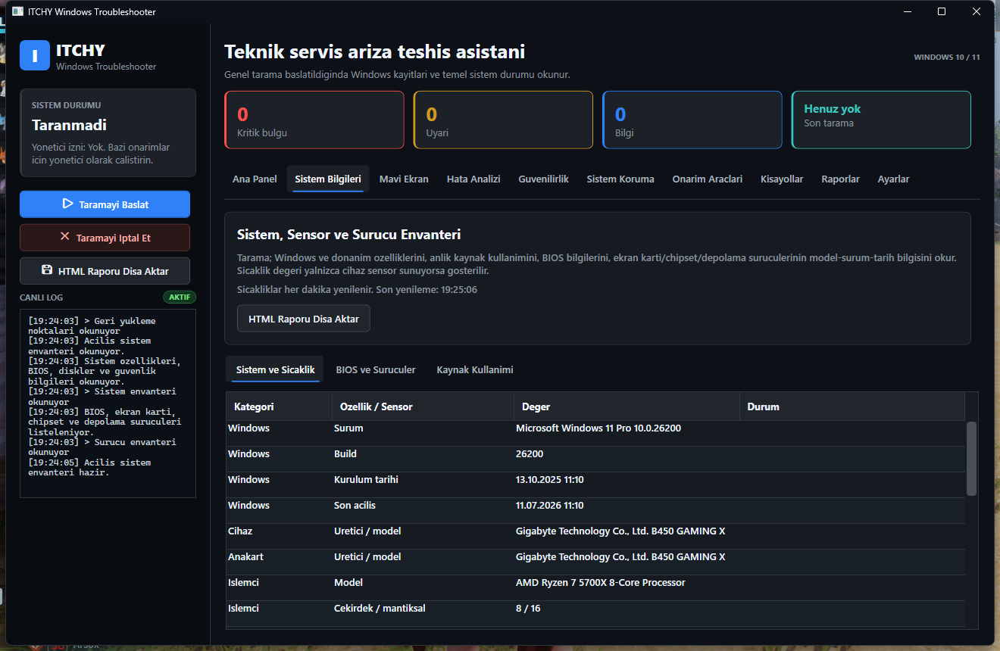
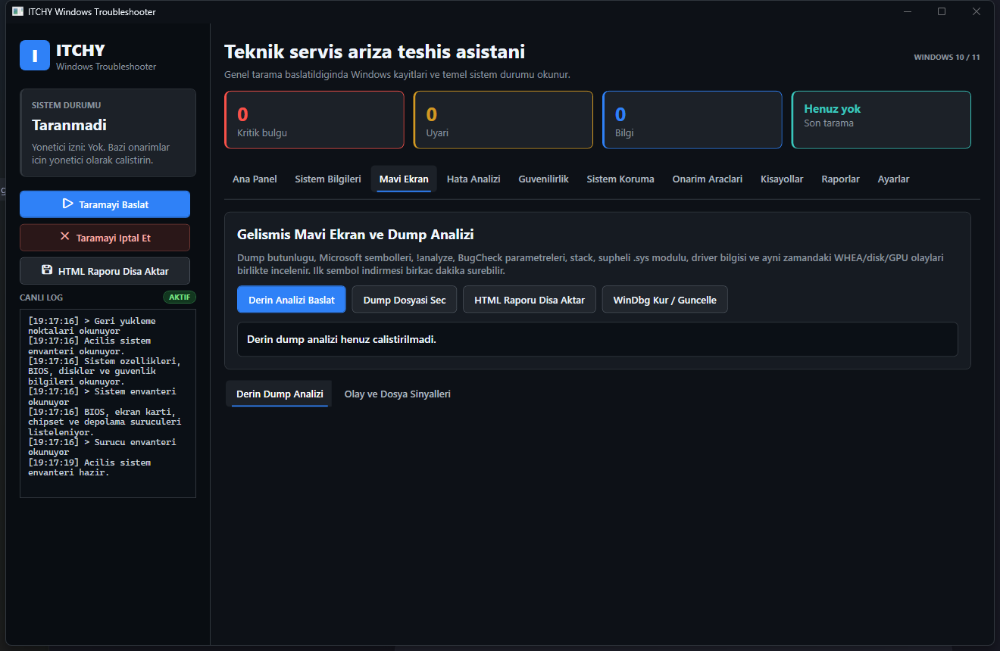

<div align="center">

# ITCHY Windows Troubleshooter

**Windows 10/11 icin teknik servis teshisi, gelismis mavi ekran analizi ve paylasilabilir sistem raporlama araci.**

[](https://github.com/Bogazitchy/Itchy-Windows-Troubleshooter/releases/latest)


[](https://github.com/Bogazitchy/Itchy-Windows-Troubleshooter/releases)

[**Son Surumu Indir**](https://github.com/Bogazitchy/Itchy-Windows-Troubleshooter/releases/latest) | [Hata Bildir](https://github.com/Bogazitchy/Itchy-Windows-Troubleshooter/issues) | [Kaynak Kodu Incele](#kaynak-koddan-derleme)

</div>



## v1.3.0: Daha Net Teshis

Bu surum yeni arac kalabaligi eklemek yerine mevcut tarama ve sonuc motorunu daha guvenilir hale getirir.

| Iyilestirme | Kullaniciya etkisi |
|---|---|
| Kanit rolleri | Kok neden adayi, dogrudan ariza, cokme kaniti, yapilandirma ve sonuc olaylari birbirinden ayrilir |
| Guven puani | Eski ve tek kaynakli kayitlar daha dusuk puanlanir; yuzde 90 ustu sonuc guclu veya cok kaynakli kanit gerektirir |
| Sonuc ozeti | Bilesen, guven, tekrar, guncellik, mavi ekran iliskisi ve ilk yapilacak islem tek yerde gorunur |
| Yanlis pozitif kontrolu | Kernel-Power ve zaman eslesmesi olmayan Code Integrity olaylari otomatik olarak kok neden sayilmaz |
| Gruplama | Tekrarlayan uygulama, servis, surucu ve Reliability kayitlari bilesen bazinda birlestirilir |
| Tarama durumu | Olay kayitlari, sistem sagligi, kaynak kullanimi ve dump analizi asamalari canli gosterilir |
| Teknik rapor | Ilk uc bulgu acik gelir; ham kayitlar kapali tutulur ve bulgudan ilgili kanita tek tikla gecilir |

## Neden ITCHY?

Windows mavi ekranlari genellikle tek bir kaynaktan anlasilmaz. `ntoskrnl.exe`, Kernel-Power 41 veya bos bir minidump klasoru tek basina kok neden degildir. ITCHY; dump, stack, surucu dosyasi, semboller ve ayni zamandaki Windows olaylarini birlikte degerlendirerek teknisyene kanitli ve guven seviyeli bir sonuc verir.

| Alan | ITCHY ne yapar? |
|---|---|
| Mavi ekran | Minidump ve `MEMORY.DMP` dosyalarini WinDbg sembolleriyle analiz eder |
| Kok neden | Stop code, stack, modul, process, failure bucket ve `.sys` surucusunu ayirir |
| Korelasyon | WHEA, disk, NVMe, NTFS, GPU, Kernel-PnP ve BugCheck olaylarini zamanla eslestirir |
| Genel tarama | Event Viewer, Reliability, aygitlar, suruculer ve kaynak kullanimini rol, guncellik ve guven puaniyla birlestirir |
| Sistem sagligi | Disk/SMART, pagefile, dump ayari, bellek testi, yeniden baslatma ve DISM durumunu kontrol eder |
| Tarama kapsami | Okunan, kismi kalan ve erisilemeyen kaynaklari ayri gosterir; eksik veriyi temiz sonuc saymaz |
| Sistem | Windows, anakart, CPU, RAM, GPU, disk, BIOS ve surucu envanterini gosterir |
| Sensor | Desteklenen cihazlarda CPU/GPU sicakliklarini her dakika yeniler |
| Rapor | Sekmeli, aranabilir HTML teknisyen raporu ve duz metin raporu uretir |
| Onarim | SFC, DISM, CHKDSK, ag, Update, Defender ve spooler araclarini kontrollu calistirir |

## Gelismis Mavi Ekran Motoru



1. `C:\Windows\Minidump`, `C:\Windows\MEMORY.DMP` veya elle secilen dump dosyasi bulunur.
2. Dosya butunlugu ve kernel dump basligi kontrol edilir; okunabilirse BugCheck kodu ve dort parametre cikarilir.
3. Microsoft WinDbg/KD/CDB ile `!analyze -v`, `.bugcheck`, `kv`, modul listesi ve blackbox verileri toplanir.
4. `Probably caused by`, `IMAGE_NAME`, `MODULE_NAME`, `PROCESS_NAME`, `FAILURE_BUCKET_ID`, `SYMBOL_NAME` ve stack adaylari ayristirilir.
5. `ntoskrnl.exe` tek basina asil neden kabul edilmez. Stack'teki anlamli surucu, dosya ureticisi ve tekrar eden dump sonuclari oncelenir.
6. Dump zamaninin +/-20 dakikasindaki WHEA, disk, GPU, NTFS ve guc olaylari eslestirilir.
7. Kullaniciya supheli bilesen, guven seviyesi, kanitlar ve onerilen islem gosterilir.

> Tek bir dump fiziksel donanimi her durumda kesin kanitlamaz. RAM, CPU, PCIe ve guc sorunlarinda guven seviyesi ile olay korelasyonu birlikte degerlendirilmelidir.

## Sekmeli Teknisyen Raporu

HTML rapor artik tek parca uzun bir sayfa degildir. Asagidaki sekmeler arasinda gecis yapilabilir ve aktif sekmede anlik arama yapilabilir:

- Genel Bakis
- Oncelikli Bulgular
- Mavi Ekran ve Dump
- Hata Kayitlari
- Saglik Denetimleri ve Tarama Kapsami
- Guvenilirlik Gecmisi
- Sistem ve Suruculer
- Koruma ve Onarim
- Ham Uygulama Logu

Ilk uc onemli bulgu dogrudan acilir; ayrintili ve ham kayitlar raporu bogmamasi icin kapali bolumlerde tutulur. Hata ve Reliability kayitlari bilesen bazinda gruplanir. Bulgu kartindaki ilgili kayit dugmesi, Hata Kayitlari sekmesine gecip kaniti otomatik arar. Tablolar sabit baslikli ve kaydirilabilir yapidadir; yazdirma veya PDF alma sirasinda butun sekmeler eksiksiz rapora eklenir.

## Sistem ve Surucu Envanteri

- Uygulama acildigi anda sistem bilgileri otomatik yuklenir.
- CPU ve GPU sicakliklari desteklenen cihazlarda 60 saniyede bir yenilenir.
- BIOS, ekran karti, chipset ve depolama denetleyicisi surum/tarih bilgileri listelenir.
- Loglar, analiz metinleri ve tablolar sag tik menusuyle panoya kopyalanabilir.
- Surucu tarihleri kesin guncellik karari olarak sunulmaz; uretici sitesiyle karsilastirma notu verilir.

## Kurulum

1. [Releases](https://github.com/Bogazitchy/Itchy-Windows-Troubleshooter/releases/latest) sayfasini acin.
2. `ITCHY-Windows-Troubleshooter-v1.3.0-win-x64.exe` dosyasini indirin.
3. Uygulamayi calistirin. Korunan dump dosyalari ve sistem onarimlari icin **Yonetici olarak calistir** secenegini kullanin.
4. Tam sembol/stack analizi icin Mavi Ekran sekmesindeki **WinDbg Kur / Guncelle** dugmesini kullanin.

Yayin EXE'si self-contained olarak hazirlanir; ayri bir .NET kurulumu gerektirmez. Uygulama kod imzali degilse Windows SmartScreen ilk acilista ek onay gosterebilir.

## Guvenlik ve Gizlilik

- Analiz verileri bilgisayarda yerel olarak islenir.
- Telemetri veya otomatik log yukleme mekanizmasi yoktur.
- Semboller yalnizca Microsoft public symbol server uzerinden indirilir.
- Registry cleaner, kontrolsuz surucu silme veya tek tik hizlandirma islemi yoktur.
- Kritik onarimlar kullanici onayi olmadan calismaz.

## Kaynak Koddan Derleme

Gereksinimler: Windows 10/11 ve [.NET 8 SDK](https://dotnet.microsoft.com/download/dotnet/8.0).

```powershell
git clone https://github.com/Bogazitchy/Itchy-Windows-Troubleshooter.git
cd Itchy-Windows-Troubleshooter
dotnet restore
dotnet build -c Release
```

Tek dosyalik self-contained Windows x64 paketi:

```powershell
dotnet publish -p:PublishProfile=ReleaseWinX64
```

Yayin dosyasi `bin\Release\single-file\ITCHY Windows Troubleshooter.exe` yolunda olusur.

## Proje Yapisi

```text
Models/                         Veri modelleri
Services/AdvancedDumpAnalysis  WinDbg, stop code, stack ve korelasyon motoru
Services/SystemAnalysis        Event Viewer ve genel teshis kurallari
Services/SystemHealthAnalysis Disk/SMART, dump, bellek ve Windows saglik denetimleri
Services/SystemInventory       Sistem, BIOS ve surucu envanteri
Services/HardwareSensor        CPU/GPU sensorleri
Services/ReportService         Sekmeli HTML/TXT rapor motoru
MainWindow.xaml                WPF kullanici arayuzu
```

## Katki

Hata kaydi veya gelistirme onerisi icin [Issues](https://github.com/Bogazitchy/Itchy-Windows-Troubleshooter/issues) bolumunu kullanabilirsiniz. Bir hata bildirirken mumkunse HTML teknisyen raporunu, Windows surumunu ve sorunun olustugu saati ekleyin; raporu herkese acik alana yuklemeden once kisisel bilgileri kontrol edin.

---

<div align="center">
  Windows sorunlarini tahminle degil, kanitla daraltmak icin gelistirildi.
</div>
