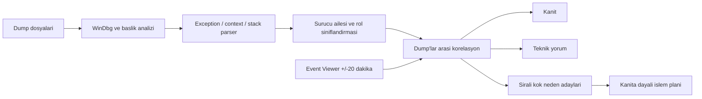

<div align="center">

# ITCHY Windows Troubleshooter

**Windows 10/11 icin teknik servis teshisi, gelismis mavi ekran analizi ve paylasilabilir sistem raporlama araci.**

[](https://github.com/Bogazitchy/Itchy-Windows-Troubleshooter/releases/latest)


[](https://github.com/Bogazitchy/Itchy-Windows-Troubleshooter/releases)

[**Son Surumu Indir**](https://github.com/Bogazitchy/Itchy-Windows-Troubleshooter/releases/latest) | [Hata Bildir](https://github.com/Bogazitchy/Itchy-Windows-Troubleshooter/issues) | [Kaynak Kodu Incele](#kaynak-koddan-derleme)

</div>


## Guncel Gelistirme: Karsilastirmali Dump Teshisi

ITCHY artik birden fazla dump dosyasini yalnizca tek tek listelemek yerine ayni bilgisayara ait bir vaka grubu olarak yorumlar. WinDbg kanitlari, stack suruculeri, exception desenleri ve dump zamanindaki Windows olaylari bir araya getirilerek teknisyen seviyesinde bir **Genel Teshis** uretilir.

| Iyilestirme | Kullaniciya etkisi |
|---|---|
| Exception analizi | `0xC0000005` gibi exception kodlari Access Violation olarak aciklanir; Read, Write veya Execute erisimi ve hedef adres ayrica gosterilir |
| Faulting instruction | Gercek debugger context'i varsa faulting adres, modul, sembol, assembly komutu ve ilgili register degerleri saklanir |
| Dump korelasyonu | BugCheck, exception, pointer deseni, process, driver ailesi ve stack tekrar oranlari tum dump'lar arasinda karsilastirilir |
| Kanit siniflandirmasi | Debugger verisi, teknik yorum ve kok neden teshisi birbirinden acikca ayrilir |
| Surucu rolleri | Dogrudan fault, `Probably caused by`, `IMAGE_NAME`, `MODULE_NAME` ve yalnizca stack varligi farkli agirliklarla degerlendirilir |
| Yanlis pozitif kontrolu | `ntoskrnl.exe`, aktif kullanici process'i ve Kernel-Power 41 tek basina asil neden kabul edilmez |
| Kanita dayali plan | DDU, surucu izolasyonu, XMP/OC kapatma ve MemTest86 adimlari yalnizca ilgili kanit varsa siralanir |
| Teknik rapor | Genel teshis, ortak desenler, supheliler, dump karsilastirmasi ve ham WinDbg ciktilari katmanli sunulur |

## Neden ITCHY?

Windows mavi ekranlari genellikle tek bir kaynaktan anlasilmaz. `ntoskrnl.exe`, Kernel-Power 41 veya bos bir minidump klasoru tek basina kok neden degildir. ITCHY; dump, stack, surucu dosyasi, semboller ve ayni zamandaki Windows olaylarini birlikte degerlendirerek teknisyene kanitli ve guven seviyeli bir sonuc verir.

| Alan | ITCHY ne yapar? |
|---|---|
| Mavi ekran | Bir veya birden fazla minidump / `MEMORY.DMP` dosyasini WinDbg sembolleriyle analiz eder |
| Kok neden | Stop code, exception, faulting instruction, context, register, stack ve `.sys` surucu rollerini ayirir |
| Korelasyon | Dump'lari kendi aralarinda; WHEA, disk, NVMe, NTFS, GPU, Kernel-PnP ve BugCheck olaylarini zamanla karsilastirir |
| Genel tarama | Event Viewer, Reliability, aygitlar, suruculer ve kaynak kullanimini rol, guncellik ve guven puaniyla birlestirir |
| Sistem sagligi | Disk/SMART, pagefile, dump ayari, bellek testi, yeniden baslatma ve DISM durumunu kontrol eder |
| Tarama kapsami | Okunan, kismi kalan ve erisilemeyen kaynaklari ayri gosterir; eksik veriyi temiz sonuc saymaz |
| Sistem | Windows, anakart, CPU, RAM, GPU, disk, BIOS ve surucu envanterini gosterir |
| Sensor | Desteklenen cihazlarda CPU/GPU sicakliklarini her dakika yeniler |
| Rapor | Sekmeli, aranabilir HTML teknisyen raporu ve duz metin raporu uretir |
| Onarim | SFC, DISM, CHKDSK, ag, Update, Defender ve spooler araclarini kontrollu calistirir |

## Gelismis Mavi Ekran Motoru




1. `C:\Windows\Minidump`, `C:\Windows\MEMORY.DMP` veya birlikte secilen dump dosyalari bulunur.
2. Dosya butunlugu ve kernel dump basligi kontrol edilir; okunabilirse BugCheck kodu ve dort parametre cikarilir.
3. Microsoft WinDbg/KD/CDB ile `!analyze -v`, `.bugcheck`, `kv`, modul listesi, register, disassembly ve blackbox verileri toplanir.
4. `BUGCHECK_CODE`, `EXCEPTION_CODE`, `FAULTING_IP`, `CONTEXT`, `PROCESS_NAME`, `IMAGE_NAME`, `MODULE_NAME`, `SYMBOL_NAME`, failure bucket/hash ve stack alanlari toleransli olarak ayristirilir.
5. 0x3B ve 0x7E gibi uygun stop code'larda gercek context record varsa `.cxr`, `r`, `kv` ve `u @rip-20 L40` ile ikinci analiz gecisi yapilir.
6. Stack'teki Windows/framework modulleri ile ucuncu parti kernel suruculeri ayrilir; her surucunun tekrar sayisi ve cokmedeki rolu hesaplanir.
7. Tum dump'larda BugCheck, exception, gecersiz adres, faulting modul, process, driver ailesi ve bellek bozulmasi desenleri karsilastirilir.
8. Dump zamaninin +/-20 dakikasindaki WHEA, Display, disk/NVMe, NTFS, Kernel-PnP ve BugCheck olaylari korelasyona eklenir.
9. Grafik surucusu, kernel surucu cakismasi, bellek/CPU kararliligi, depolama, ag ve donanim kategorileri kanit gucune gore siralanir.

### Ornek toplu sonuc

```text
4 dump dosyasi incelendi.
3 x KMODE_EXCEPTION_NOT_HANDLED (0x1E)
1 x SYSTEM_SERVICE_EXCEPTION (0x3B)

4/4 dump: 0xC0000005 Access Violation.
Bir dump dogrudan nvlddmkm.sys icinde coktu.
Cokmeler farkli kullanici process'leri sirasinda olustu.

En guclu yazilimsal supheli: NVIDIA Display Driver.
Ikincil aday: ucuncu parti kernel surucusu cakismasi.
RAM / XMP / CPU bellek kararliligi test edilmelidir.
```

> Tek bir dump fiziksel donanimi her durumda kesin kanitlamaz. RAM, CPU, PCIe ve guc sorunlarinda guven seviyesi ile olay korelasyonu birlikte degerlendirilmelidir.

### Lokal ve deterministik

Dump analizi icin OpenAI, Gemini, Claude veya baska bir harici AI servisi kullanilmaz. Teshis; WinDbg ciktisi, bakimi yapilabilir bugcheck bilgisi, surucu siniflandirmasi ve lokal kural/korelasyon motoruyla uretilir. Dump dosyalari yuklenmez; internet yalnizca Microsoft public symbol server sembolleri icin kullanilabilir.

## Sekmeli Teknisyen Raporu

HTML rapor artik tek parca uzun bir sayfa degildir. Asagidaki sekmeler arasinda gecis yapilabilir ve aktif sekmede anlik arama yapilabilir:

- Genel Bakis
- Oncelikli Bulgular
- Mavi Ekran ve Dump
- Hata Kayitlari
- Saglik Denetimleri ve Tarama Kapsami
- Guvenilirlik Gecmisi
- Sistem ve Suruculer
- Koruma ve Onarim
- Ham Uygulama Logu

Mavi Ekran sekmesi once **Genel Teshis**, **Ortak Dump Desenleri**, **Supheli Kaynaklar**, **Troubleshooting Sirasi** ve **Dump Karsilastirmasi** bolumlerini gosterir. Tek tek dump ayrintilari ve ham WinDbg ciktilari daha sonra gelir. Ilk onemli bulgular dogrudan acilir; ayrintili ve ham kayitlar raporu bogmamasi icin kapali bolumlerde tutulur. Tablolar sabit baslikli ve kaydirilabilir yapidadir; yazdirma veya PDF alma sirasinda butun sekmeler eksiksiz rapora eklenir.

## Sistem ve Surucu Envanteri

- Uygulama acildigi anda sistem bilgileri otomatik yuklenir.
- CPU ve GPU sicakliklari desteklenen cihazlarda 60 saniyede bir yenilenir.
- BIOS, ekran karti, chipset ve depolama denetleyicisi surum/tarih bilgileri listelenir.
- Loglar, analiz metinleri ve tablolar sag tik menusuyle panoya kopyalanabilir.
- Surucu tarihleri kesin guncellik karari olarak sunulmaz; uretici sitesiyle karsilastirma notu verilir.

## Kurulum

1. [Releases](https://github.com/Bogazitchy/Itchy-Windows-Troubleshooter/releases/latest) sayfasini acin.
2. `ITCHY-Windows-Troubleshooter-v1.3.0-win-x64.exe` dosyasini indirin.
3. Uygulamayi calistirin. Korunan dump dosyalari ve sistem onarimlari icin **Yonetici olarak calistir** secenegini kullanin.
4. Tam sembol/stack analizi icin Mavi Ekran sekmesindeki **WinDbg Kur / Guncelle** dugmesini kullanin.

Yayin EXE'si self-contained olarak hazirlanir; ayri bir .NET kurulumu gerektirmez. Uygulama kod imzali degilse Windows SmartScreen ilk acilista ek onay gosterebilir.

## Guvenlik ve Gizlilik

- Analiz verileri bilgisayarda yerel olarak islenir.
- Telemetri veya otomatik log yukleme mekanizmasi yoktur.
- Semboller yalnizca Microsoft public symbol server uzerinden indirilir.
- Registry cleaner, kontrolsuz surucu silme veya tek tik hizlandirma islemi yoktur.
- Kritik onarimlar kullanici onayi olmadan calismaz.

## Kaynak Koddan Derleme

Gereksinimler: Windows 10/11 ve [.NET 8 SDK](https://dotnet.microsoft.com/download/dotnet/8.0).

```powershell
git clone https://github.com/Bogazitchy/Itchy-Windows-Troubleshooter.git
cd Itchy-Windows-Troubleshooter
dotnet restore
dotnet build -c Release
dotnet test Tests\ItchyWindowsTroubleshooter.Tests.csproj -c Release
```

Tek dosyalik self-contained Windows x64 paketi:

```powershell
dotnet publish -p:PublishProfile=ReleaseWinX64
```

Yayin dosyasi `bin\Release\single-file\ITCHY Windows Troubleshooter.exe` yolunda olusur.

## Proje Yapisi

```text
Models/                         Dump, korelasyon ve uygulama veri modelleri
Services/AdvancedDumpAnalysis  WinDbg calistirma ve analiz orkestrasyonu
Services/WinDbgOutputParser    Exception, context, register, stack ve disassembly parser'i
Services/BugCheckKnowledgeBase Stop code semantigi ve parametre bilgisi
Services/DriverClassification  Windows/ucuncu parti surucu ve aile tanima katmani
Services/DumpCorrelation       Coklu dump kok neden skorlama ve islem sirasi
Services/SystemAnalysis        Event Viewer ve genel teshis kurallari
Services/SystemHealthAnalysis  Disk/SMART, dump, bellek ve Windows saglik denetimleri
Services/SystemInventory       Sistem, BIOS ve surucu envanteri
Services/HardwareSensor        CPU/GPU sensorleri
Services/ReportService         Sekmeli HTML/TXT rapor motoru
Tests/                          Sentetik WinDbg parser ve korelasyon testleri
MainWindow.xaml                WPF kullanici arayuzu
```

## Katki

Hata kaydi veya gelistirme onerisi icin [Issues](https://github.com/Bogazitchy/Itchy-Windows-Troubleshooter/issues) bolumunu kullanabilirsiniz. Bir hata bildirirken mumkunse HTML teknisyen raporunu, Windows surumunu ve sorunun olustugu saati ekleyin; raporu herkese acik alana yuklemeden once kisisel bilgileri kontrol edin.

---

<div align="center">
  Windows sorunlarini tahminle degil, kanitla daraltmak icin gelistirildi.
</div>
